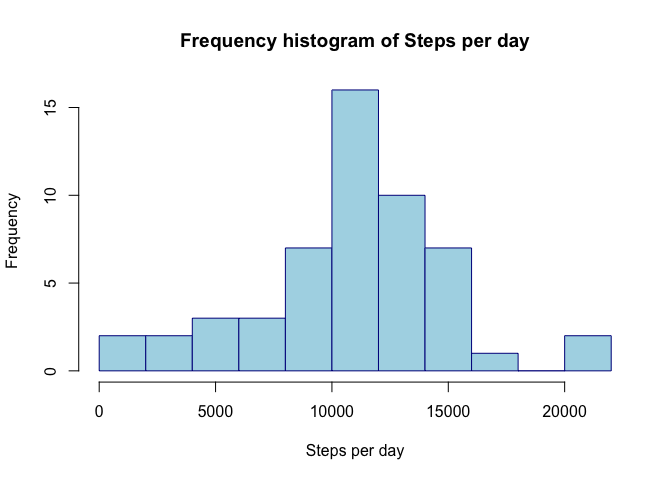
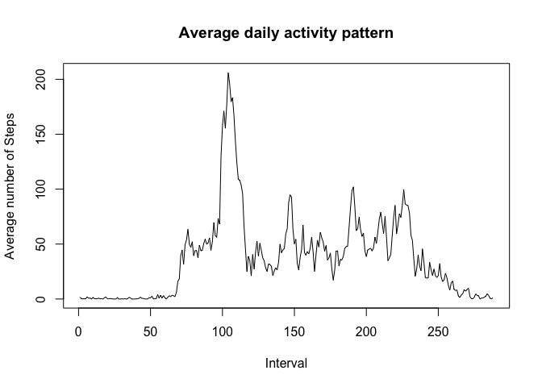
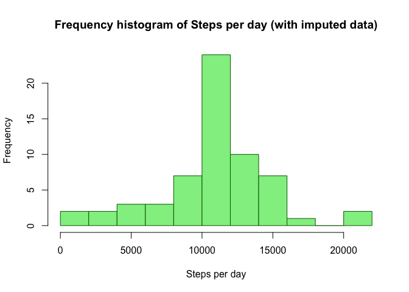
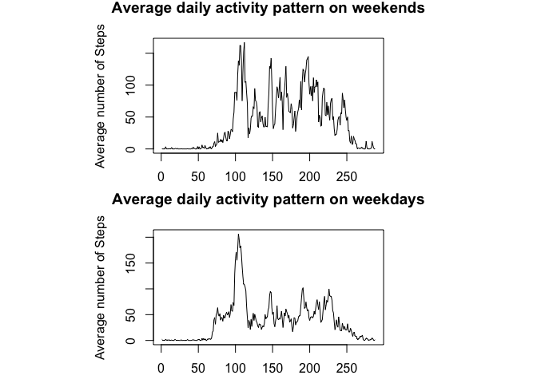

# Reproducible Research: Peer Assessment 1
Katarina Mayer  
February 7, 2016  

# Introduction
This report analyzes data from a personal monitoring device. The data was collected by a device for un anonymous individual, at 5 minute intervals during months of October and November, 2012. The corresponding dataset can be downloaded [here] [1].

## Data
The dataset is stored as a coma separated value (csv) file with 17,568 observations. There are 3 variables in this dataset: *steps*, *date* and *interval*. *Steps* shows the number of steps taken in a 5-minute interval, *date* shows the date when the measurement was recorded and *interval* identifies the time interval when this measurement was taken.

## Loading and preprocessing the data
Let's start with loading the necessary packages.


```r
library(knitr)
opts_chunk$set(echo=TRUE)
library(dplyr)
```

```
## Warning: package 'dplyr' was built under R version 3.1.2
```

```
## 
## Attaching package: 'dplyr'
```

```
## The following object is masked from 'package:stats':
## 
##     filter
```

```
## The following objects are masked from 'package:base':
## 
##     intersect, setdiff, setequal, union
```

```r
library(lubridate)
library(ggplot2)
```

```
## Warning: package 'ggplot2' was built under R version 3.1.3
```

```r
library(gridExtra)
```

```
## Loading required package: grid
```
Now we are ready to load in the dataset.

```r
my_data <- read.csv("/Users/katarinamayer/Desktop/RepData_PeerAssessment1/activity.csv",header=TRUE,sep=",",colClasses=c("numeric","character","integer"))
```
It may also be useful to convert the second variable into a proper date format.

```r
my_data$date <- as.Date(my_data$date)
```

Let's take a look at the the dataset. First, let's inspect the first six rows:


```r
head(my_data)
```

```
##   steps       date interval
## 1    NA 2012-10-01        0
## 2    NA 2012-10-01        5
## 3    NA 2012-10-01       10
## 4    NA 2012-10-01       15
## 5    NA 2012-10-01       20
## 6    NA 2012-10-01       25
```

Looks great! How about the last six rows...


```r
tail(my_data)
```

```
##       steps       date interval
## 17563    NA 2012-11-30     2330
## 17564    NA 2012-11-30     2335
## 17565    NA 2012-11-30     2340
## 17566    NA 2012-11-30     2345
## 17567    NA 2012-11-30     2350
## 17568    NA 2012-11-30     2355
```

And now lets summarize the data to get the general idea about it.


```r
summary(my_data)
```

```
##      steps             date               interval     
##  Min.   :  0.00   Min.   :2012-10-01   Min.   :   0.0  
##  1st Qu.:  0.00   1st Qu.:2012-10-16   1st Qu.: 588.8  
##  Median :  0.00   Median :2012-10-31   Median :1177.5  
##  Mean   : 37.38   Mean   :2012-10-31   Mean   :1177.5  
##  3rd Qu.: 12.00   3rd Qu.:2012-11-15   3rd Qu.:1766.2  
##  Max.   :806.00   Max.   :2012-11-30   Max.   :2355.0  
##  NA's   :2304
```


## What is mean total number of steps taken per day?
Now let's calculate the number of steps taken each day.


```r
my_data.f <- filter(my_data, !is.na(my_data$steps))
daily_steps <- group_by(my_data.f,date)
table <- summarize(daily_steps,total_steps = sum(steps,na.rm=TRUE))
head(table)
```

```
## Source: local data frame [6 x 2]
## 
##         date total_steps
## 1 2012-10-02         126
## 2 2012-10-03       11352
## 3 2012-10-04       12116
## 4 2012-10-05       13294
## 5 2012-10-06       15420
## 6 2012-10-07       11015
```

To get an idea about the daily steps distribution, let's take a look at the histogram


```r
hist <- hist(table$total_steps, nclass = 11, plot = FALSE)
plot(hist, border = "dark blue", col = "light blue",
     main = "Frequency histogram of Steps per day", xlab = "Steps per day", ylab = "Frequency")
```



Now I calculate the mean and median number of steps taken per day.


```r
mean_steps <- mean(table$total_steps)
median_steps <- median(table$total_steps)
mean_steps
```

```
## [1] 10766.19
```

```r
median_steps
```

```
## [1] 10765
```

## What is the average daily activity pattern?
It might be interesting to take a look at the average number of steps taken over certain time interval of a day (over the whole time period). This can be done by summarizing the data over time intervals and then looking at its time series plot.


```r
my_data.f <- filter(my_data, !is.na(my_data$steps))
interv_steps <- group_by(my_data.f,interval)
table <- summarize(interv_steps,avg_steps = mean(steps,na.rm=TRUE))
head(table)
```

```
## Source: local data frame [6 x 2]
## 
##   interval avg_steps
## 1        0 1.7169811
## 2        5 0.3396226
## 3       10 0.1320755
## 4       15 0.1509434
## 5       20 0.0754717
## 6       25 2.0943396
```

Let's take a look at the time series plot now.


```r
time_plot <- plot(table$avg_steps, main = "Average daily activity pattern", xlab = "Interval", ylab = "Average number of Steps", type="l")
```



To determine the most active interval in a day (the interval with the largest number of steps), I will use which.max() function.


```r
table[which.max(table$avg_steps),]
```

```
## Source: local data frame [1 x 2]
## 
##   interval avg_steps
## 1      835  206.1698
```

So, the time interval when this person made the most steps is the interval 835. On average, this person made 206 steps during this time interval.


## Imputing missing values

First, let's determin how many missing values there are in this dataset.


```r
sum(is.na(my_data$steps))
```

```
## [1] 2304
```

There are 2304 missing values in this dataset. One way to replace these missing values by data is to use an average number of steps in this particular time interval.


```r
imputed_data <- my_data
is_missing <- is.na(imputed_data$steps)
avg_replaced <- tapply(imputed_data$steps, imputed_data$interval, mean, na.rm=TRUE, simplify=TRUE)
imputed_data$steps[is_missing] <- avg_replaced[as.character(imputed_data$interval[is_missing])]
```

To compare this dataset with the one where I've dropped all missing values, I will create a histogram of steps per day.


```r
imputed_data.f2 <- filter(imputed_data, !is.na(imputed_data$steps))
daily_steps <- group_by(imputed_data.f2,date)
table2 <- summarize(daily_steps,total_steps = sum(steps,na.rm=TRUE))
head(table2)
```

```
## Source: local data frame [6 x 2]
## 
##         date total_steps
## 1 2012-10-01    10766.19
## 2 2012-10-02      126.00
## 3 2012-10-03    11352.00
## 4 2012-10-04    12116.00
## 5 2012-10-05    13294.00
## 6 2012-10-06    15420.00
```

To get an idea about the daily steps distribution, let's take a look at the histogram


```r
hist <- hist(table2$total_steps, nclass = 11, plot = FALSE)
plot(hist, border = "dark green", col = "light green",
     main = "Frequency histogram of Steps per day (with imputed data)", xlab = "Steps per day", ylab = "Frequency")
```



There are some small changes in the appearance of the histogram. Now I recalculate the mean and median number of steps taken per day (for the dataset with imputed missing values).


```r
mean_steps_imp <- mean(table2$total_steps)
median_steps_imp <- median(table2$total_steps)
mean_steps_imp
```

```
## [1] 10766.19
```

```r
median_steps_imp
```

```
## [1] 10766.19
```

I can now compare these values to the ones I have calculated without missing values replaced. As you can see, replacing missing values by their respective interval means had no effect on the mean but it slightly increased median value.


## Are there differences in activity patterns between weekdays and weekends?
To determine whether there are any differences in activity for weekdays and weekends, I will create a new factor variable using weekdays() method.


```r
imputed_data.f2 <- mutate(imputed_data.f2, daytype = ifelse(weekdays(imputed_data.f2$date) == "Saturday" | weekdays(imputed_data.f2$date) == "Sunday", "weekend", "weekday"))
imputed_data_weekend <- filter(imputed_data.f2, daytype == "weekend")
imputed_data_weekday <- filter(imputed_data.f2, daytype == "weekday")
```
Now I can calculate the average number of steps for both weekdays and weekends and compare them.

```r
par(mfrow=c(2,1), pin = c(3, 1.5))

interv_steps_weekend <- group_by(imputed_data_weekend, interval)
table_weekend <- summarize(interv_steps_weekend, avg_steps = mean(steps,na.rm=TRUE))
time_plot_weekend <- plot(table_weekend$avg_steps, main = "Average daily activity pattern on weekends", xlab = "Interval", ylab = "Average number of Steps", type="l")

interv_steps_weekday <- group_by(imputed_data_weekday,interval)
table_weekday <- summarize(interv_steps_weekday,avg_steps = mean(steps,na.rm=TRUE))
time_plot_weekday <- plot(table$avg_steps, main = "Average daily activity pattern on weekdays", xlab = "Interval", ylab = "Average number of Steps", type="l")
```



Based on the plots above it is clear that this person excercises in regular time (in the morning) on weekdays. On weekends the excercise appears to be more spread over whole day.

[1]: (https://github.com/mayerkat/RepData_PeerAssessment1/blob/master/activity.zip)
